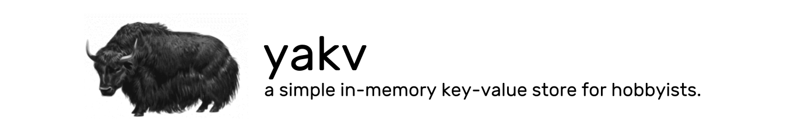
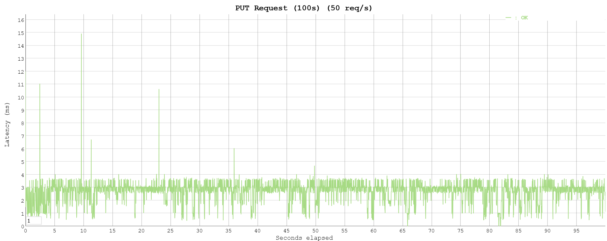

<div align="center">
    
    <br>
</div>

yakv (*yak-v. (originally intended to be "yet-another-key-value store")*) is a simple, in-memory, concurrency-safe key-value store for hobbyists.

yakv provides persistence by appending transactions to a transaction log and restoring data from the transaction log on startup.

yakv is designed with simplicity as the main purpose and has *almost zero external dependencies*.

## Installation:

Install using:

- **One-Script Installation (Linux):**
    ```
    curl https://raw.githubusercontent.com/burntcarrot/yakv/main/install.sh | bash
    ```

- **Docker**:
    ```
    git clone https://github.com/burntcarrot/yakv
    cd yakv
    docker build --tag yakv .
    docker run -p 8080:8080 yakv /bin/sh -c "/yakv -host 0.0.0.0"
    ```
- **Install from source:**

    You can run directly from the source files:
    ```
    git clone https://github.com/burntcarrot/yakv
    cd yakv
    go run main.go -port 8080
    ```
    Or, you can build the binary on your own:
    ```
    git clone https://github.com/burntcarrot/yakv
    cd yakv
    go build
    ```

## Methods:

yakv exposes a HTTP/HTTPS API and provides 3 methods to deal with data:

- **GET**:
    - On a HTTPS server without certificate:
    ```
    curl -X GET --header "Content-Type: application/json" -d '{"key": "yakv"}' https://0.0.0.0:8080/yakv/v0/get --insecure
    ```
    - On a HTTP server:
    ```
    curl -X GET --header "Content-Type: application/json" -d '{"key": "yakv"}' http://0.0.0.0:8080/yakv/v0/get
    ```
- **PUT**:
    - On a HTTPS server without certificate:
    ```
    curl -X PUT --header "Content-Type: application/json" -d '{"key": "yakv", "value": "Hello, yakv!"}' https://0.0.0.0:8080/yakv/v0/put --insecure
    ```
    - On a HTTP server:
    ```
    curl -X PUT --header "Content-Type: application/json" -d '{"key": "yakv", "value": "Hello, yakv!"}' http://0.0.0.0:8080/yakv/v0/put
    ```
- **DELETE**:
    - On a HTTPS server without certificate:
    ```
    curl -X DELETE --header "Content-Type: application/json" -d '{"key": "yakv"}' https://0.0.0.0:8080/yakv/v0/delete --insecure
    ```
    - On a HTTP server:
    ```
    curl -X DELETE --header "Content-Type: application/json" -d '{"key": "yakv"}' http://0.0.0.0:8080/yakv/v0/delete
    ```

yakv currently accepts request bodies in the form of JSON.

## Options:

Here are the list of options or the command line flags provided by yakv:

```
yakv [OPTIONS]

OPTIONS:
    - port
        Port number for starting yakv.
    - host
        Host address for starting yakv.

    -secure
        Enable TLS-encrypted connection.
    - cert
        Filename for certificate.
    - key
        Filename for private key.

    -filename
        Filename for transaction log.
```

## Transaction Log:

All of the transactions are backed up in a transaction log, which are automatically loaded up by yakv on start-up.

## Security:

yakv provides a TLS-encrypted HTTPS connection using the `-secure` flag.

A certificate and a matching private key for the server must be provided through the `-cert` and `-key` flags respectively.

If the flags are not provided, yakv assumes the certificate and key to be named as `cert.pem` and `key.pem` in the current directory.

Example:

**On Docker:**

```
docker run -p 8080:8080 yakv /bin/sh -c "/yakv -host 0.0.0.0 -secure tls"
```

**Locally:**
- From source code:
    ```
    go run main.go -port 8080 -secure tls
    ```
- From binary:
    ```
    ./yakv -port 8080 -secure tls
    ```

## Benchmarks:

**5,000 PUT requests in 100 seconds *(50 requests/second)***:

```
Requests      [total, rate, throughput]         5000, 50.01, 50.01
Duration      [total, attack, wait]             1m40s, 1m40s, 1.13ms
Latencies     [min, mean, 50, 90, 95, 99, max]  467.4µs, 2.687ms, 2.949ms, 3.579ms, 3.652ms, 3.723ms, 14.932ms
Bytes In      [total, mean]                     0, 0.00
Bytes Out     [total, mean]                     185000, 37.00
Success       [ratio]                           100.00%
Status Codes  [code:count]                      201:5000
Error Set:
```



## Attributions:

The yak vector is provided by [OpenClipart/FreeSVG](https://freesvg.org/vector-drawing-of-a-yak) under the [Public Domain](https://creativecommons.org/licenses/publicdomain/).
